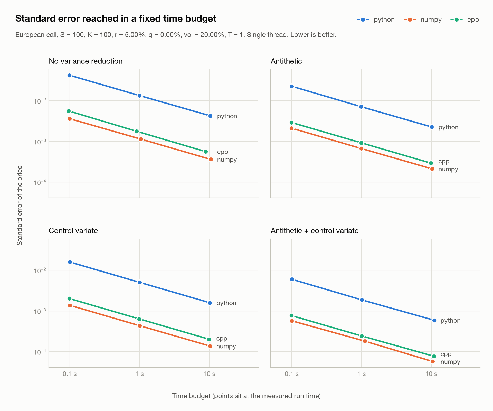

# derivkit

Python toolkit for pricing derivative contracts with **explicit numerical error control**,
and a built-in comparison of three interchangeable Monte Carlo back ends: pure Python,
NumPy and C++.

[](pyproject.toml)
[](LICENSE)

## Back-end comparison

`derivkit` prices the same option with three interchangeable Monte Carlo back ends and
measures them against each other. Everything below was measured on one machine (Apple M5,
one thread, on battery with Low Power Mode off). The full tables, the exact command and
the environment are in [benchmarks/RESULTS.md](benchmarks/RESULTS.md).



**Standard error reached in a fixed time.** European call, S = K = 100, r = 5%, q = 0,
vol = 20%, T = 1. Smaller is better.

| Variance reduction | Time budget | python | numpy | cpp |
| --- | --- | ---: | ---: | ---: |
| No variance reduction | 0.1 s | 4.24 x 10^-2 | 3.62 x 10^-3 | 5.62 x 10^-3 |
| No variance reduction | 1 s | 1.34 x 10^-2 | 1.14 x 10^-3 | 1.78 x 10^-3 |
| No variance reduction | 10 s | 4.25 x 10^-3 | 3.62 x 10^-4 | 5.62 x 10^-4 |
| Antithetic | 0.1 s | 2.27 x 10^-2 | 2.12 x 10^-3 | 2.92 x 10^-3 |
| Antithetic | 1 s | 7.15 x 10^-3 | 6.70 x 10^-4 | 9.24 x 10^-4 |
| Antithetic | 10 s | 2.26 x 10^-3 | 2.12 x 10^-4 | 2.92 x 10^-4 |
| Control variate | 0.1 s | 1.60 x 10^-2 | 1.37 x 10^-3 | 2.02 x 10^-3 |
| Control variate | 1 s | 5.04 x 10^-3 | 4.35 x 10^-4 | 6.38 x 10^-4 |
| Control variate | 10 s | 1.59 x 10^-3 | 1.37 x 10^-4 | 2.02 x 10^-4 |
| Antithetic + control variate | 0.1 s | 6.00 x 10^-3 | 5.73 x 10^-4 | 7.71 x 10^-4 |
| Antithetic + control variate | 1 s | 1.87 x 10^-3 | 1.81 x 10^-4 | 2.44 x 10^-4 |
| Antithetic + control variate | 10 s | 5.91 x 10^-4 | 5.73 x 10^-5 | 7.70 x 10^-5 |

**Speed at 10^7 paths, no variance reduction.** Run time is the median of 7 runs after a
warm-up.

| Back end | Paths | Price | Std. error | Abs. error vs BS | Run time, median (s) | min (s) | max (s) | Paths / s | CPU / wall |
| --- | ---: | ---: | ---: | ---: | ---: | ---: | ---: | ---: | ---: |
| python | 10,000,000 | 10.454013 | 4.66 x 10^-3 | 3.43 x 10^-3 | 8.308 | 8.27 | 8.376 | 1.20 M | 1.00 |
| numpy | 10,000,000 | 10.455593 | 4.66 x 10^-3 | 5.01 x 10^-3 | 0.0603 | 0.06017 | 0.06084 | 165.84 M | 1.00 |
| cpp | 10,000,000 | 10.454013 | 4.66 x 10^-3 | 3.43 x 10^-3 | 0.1293 | 0.1291 | 0.1337 | 77.31 M | 1.00 |

What the numbers say:

- **NumPy is the fastest back end.** It runs the same paths about 1.7 to 2.1 times faster
  than the C++ back end (C++ is 0.47x to 0.58x NumPy across every setting measured).
- **C++ is 60 to 68 times faster than pure Python**, and with the same seed it returns the
  same price as pure Python, because the two share a random stream.
- **Variance reduction is worth about as much as the back end.** In one second, turning on
  both methods cuts the standard error about 6.3 to 7.3 times, depending on the back end,
  while moving from pure Python to C++ cuts it about 8 times.
- **Why C++ does not beat NumPy here:** NumPy's inner loops are compiled code too, and it
  uses a cheaper normal sampler. [docs/cpp_walkthrough.md](docs/cpp_walkthrough.md)
  shows where the time goes in each back end and what would make the C++ faster.

### Build the C++ back end

The C++ back end is optional. It needs a C++20 compiler (GCC or Clang), CMake 3.18 or
newer, and pybind11.

```bash
source .venv/bin/activate            # the build uses the active Python
pip install -e ".[dev,numpy,cpp]"
cmake -S . -B build -DCMAKE_BUILD_TYPE=Release
cmake --build build
python -c "import derivkit; print(derivkit.available_backends())"
# ('python', 'numpy', 'cpp')
```

The build is Release with `-O3 -ffp-contract=off`, single-threaded, and does not use
`-ffast-math`. It places `_mc_cpp_ext.*.so` next to the Python sources, so it works with
the editable install above. Wheels built from this repo contain the pure-Python package
only. MSVC is not supported.

### Pick a back end

```python
from derivkit import OptionType, VanillaSpec, VarianceReduction
from derivkit.monte_carlo import McConfig, european

spec = VanillaSpec(spot=100, strike=100, rate=0.05, vol=0.20, time=1.0, type=OptionType.CALL)
cfg = McConfig(paths=1_000_000, seed=1, vr=VarianceReduction.ANTITHETIC)

european(spec, cfg)                    # "python": the default, standard library only
european(spec, cfg, backend="numpy")   # needs NumPy
european(spec, cfg, backend="cpp")     # needs the built extension
```

`european`, `european_adaptive` and `arithmetic_asian` all take `backend`. The three back
ends accept the same arguments and return the same `PricingResult`. With the same seed,
`python` and `cpp` return the same price; `numpy` uses a different random stream, so its
price differs within the standard error. Asking for a back end that is not installed
raises `BackendUnavailableError` with the command that installs or builds it.

### Rerun the comparison

```bash
python -m derivkit compare                      # quick: 10^5 paths, no variance reduction
python -m derivkit compare --paths 1e6 --vr all --budgets 0.1 1

# The full run behind benchmarks/RESULTS.md and the plot above (8 to 15 minutes):
python -m derivkit compare --paths 1e5 1e6 1e7 --vr all --budgets 0.1 1 10 \
    --report benchmarks/RESULTS.md --plot benchmarks/accuracy_vs_time.png
```

The same thing from Python:

```python
import derivkit
print(derivkit.compare(spec, cfg).table())
print(derivkit.accuracy_per_second(spec, budgets=(0.1, 1.0)).table())
```

The plot needs matplotlib (`pip install -e ".[bench]"`). On a laptop, plug in and turn
off any low-power mode first; the report records the power state it ran under.

## Error control

The same discipline that makes a CR3BP integrator trustworthy - adaptive refinement, a
computable error estimate, and tests that check orders of accuracy - is applied here to
Black-Scholes analytics, binomial and trinomial trees, and Monte Carlo with antithetic
and control variates.

## Features

| Engine | What it prices | Error diagnostic |
| --- | --- | --- |
| Black-Scholes-Merton | European vanilla, geometric Asian, Greeks | a few ulps |
| Implied volatility | Newton + residual-controlled bisection | \|BS(σ) − market\| |
| CRR / Jarrow-Rudd binomial | European and American vanilla | \|P(N) − P(N/2)\| |
| Leisen-Reimer binomial | Smooth second-order European (American too) | successive difference |
| Kamrad-Ritchken trinomial | European and American vanilla | successive difference |
| Monte Carlo (exact GBM) | European, arithmetic Asian | sample standard error |
| Antithetic + control variates | Europeans (control = S_T); Asians (control = geometric) | reduced standard error |
| Adaptive drivers | trees double N; MC grows paths | user `abs_tol` / `stderr_tol` |
| Monte Carlo back ends | the same pricers on pure Python, NumPy or C++ | `python -m derivkit compare` |
| Groww option chain | live NIFTY / BANKNIFTY / stocks → derivkit prices | Black-76 vs LTP (Rs), IV vs Groww IV (vol points) |

The core library has no third-party dependencies: every engine, including Monte Carlo on
its default `python` back end, runs on the standard library alone. The `numpy` and `cpp`
Monte Carlo back ends are optional extras. Tests use pytest. Examples include a Groww
option-chain client.

## Quick start

```bash
python3 -m venv .venv
source .venv/bin/activate
pip install -e ".[dev]"
pytest
python examples/vanilla_comparison.py
python examples/groww_chain.py          # bundled NIFTY chain; live with GROWW_ACCESS_TOKEN
```

Python 3.11 or newer is required.

```python
from derivkit import (
    OptionType,
    VanillaSpec,
    VarianceReduction,
    european,
    greeks,
    leisen_reimer,
    price,
)
from derivkit.monte_carlo import AdaptiveMcConfig, McConfig, european_adaptive
from derivkit.trees import AdaptiveTreeConfig, adaptive

spec = VanillaSpec(
    spot=100, strike=100, rate=0.05,
    dividend=0.0, vol=0.20, time=1.0,
    type=OptionType.CALL,
)

analytic = price(spec)
g = greeks(spec)
tree_px = leisen_reimer(spec, 101)
mc_px = european(spec, McConfig(
    paths=100000,
    seed=1,
    vr=VarianceReduction.ANTITHETIC | VarianceReduction.CONTROL_VARIATE,
))
```

Every numerical call returns a `PricingResult` with `value`, `error_estimate`, and the
amount of work performed (steps or paths). Treat that error the way you would treat an
RK45 local truncation estimate: if it is not small enough, ask the adaptive driver for
more work.

```python
refined = adaptive(spec, AdaptiveTreeConfig(abs_tol=1e-6))
mc_ok = european_adaptive(spec, AdaptiveMcConfig(stderr_tol=1e-3))
```

## Why the error-control contract

A closed-form price without a residual, a tree without a truncation check, and a Monte
Carlo estimate without a standard error are all unfinished numerical methods. `derivkit`
makes the diagnostic part of the return type so it cannot be forgotten:

- **Analytic identities** (put-call parity, round-trip implied vol) are tested to ~1 x 10^-12.
- **Trees** expose \|P(N) − P(N/2)\| and can Richardson-extrapolate CRR's O(1/N) term.
- **Leisen-Reimer** is the high-order lattice: it matches Φ(d₁), Φ(d₂) so a European
  with a few hundred steps sits well inside a basis point of Black-Scholes.
- **Monte Carlo** uses Welford moments, exact GBM sampling (no Euler bias on vanillas),
  and optional antithetic / control variates. Adaptive sampling stops on standard error,
  not on a guessed path count.

The mapping from an orbital toolkit is intentional:

| CR3BP-style integrator | derivkit |
| --- | --- |
| Adaptive Runge-Kutta step | Adaptive tree depth / MC path count |
| Local truncation error | \|P(N)−P(N/2)\| or MC standard error |
| Event / root finding with residual | Implied vol Newton + bisection residual |
| Conserved quantities | Put-call parity, model-free price bounds |

Formulas and references: [docs/methods.md](docs/methods.md).

## Example numbers

European call, S = K = 100, r = 5%, σ = 20%, T = 1. Black-Scholes = **10.45058357**.

Absolute error versus N (`python examples/convergence.py`):

| N | CRR | Jarrow-Rudd | Leisen-Reimer | Trinomial |
| ---: | ---: | ---: | ---: | ---: |
| 51 | 3.4 x 10^-2 | 2.7 x 10^-2 | 1.3 x 10^-4 | 3.9 x 10^-2 |
| 101 | 1.7 x 10^-2 | 9.1 x 10^-3 | 3.4 x 10^-5 | 2.0 x 10^-2 |
| 401 | 4.4 x 10^-3 | 4.7 x 10^-3 | 2.2 x 10^-6 | 5.0 x 10^-3 |
| 801 | 2.2 x 10^-3 | 2.0 x 10^-3 | 5.5 x 10^-7 | 2.5 x 10^-3 |

Leisen-Reimer is the high-order lattice: at 101 steps it is already inside 0.04 cents of Black-Scholes. CRR with Richardson on even N drops the 401-step error from ~4 x 10^-3 to ~1 x 10^-6.

American put, S = 36, K = 40, r = 6%, σ = 20%, T = 1:

| Method | Price |
| --- | ---: |
| European Black-Scholes | 3.844308 |
| CRR American, N = 801 | 4.486399 |
| Kamrad-Ritchken American, N = 801 | 4.486245 |
| Adaptive trinomial (tol 5 x 10^-4) | 4.486403 |

Early-exercise premium ≈ **0.642**.

Variance reduction, 50,000 European paths, seed 42 (`python examples/variance_reduction.py`).
The `python` and `cpp` back ends draw N(0,1) from mt19937_64 + Box-Muller:

| Method | Price | Std. err. | Variance ratio |
| --- | ---: | ---: | ---: |
| Crude | 10.544 | 6.6 x 10^-2 | 1.0 |
| Antithetic | 10.463 | 3.3 x 10^-2 | 4.1 |
| Control (S_T) | 10.459 | 2.5 x 10^-2 | 7.0 |
| Antithetic + control | 10.459 | 8.8 x 10^-3 | **57** |

Arithmetic Asian, 50 fixings, 20,000 paths. Geometric closed form = 5.641058. The geometric-average control is the classical pairing and is worth three orders of magnitude in variance:

| Method | Std. err. | Variance ratio |
| --- | ---: | ---: |
| Crude | 5.7 x 10^-2 | 1 |
| Antithetic | 2.8 x 10^-2 | 4 |
| Geometric control | 1.6 x 10^-3 | 1,300 |
| Antithetic + geo-control | 1.2 x 10^-3 | **2,300** |

## Project layout

```
src/derivkit/       library
cpp/                C++20 Monte Carlo kernel and its pybind11 binding
CMakeLists.txt      builds the C++ extension
benchmarks/         RESULTS.md, the plot, and where-the-time-goes profilers
tests/              pytest suite
examples/           comparison, American put, VR study, convergence, implied vol,
                    Groww NIFTY chain
examples/data/      bundled Groww-shaped NIFTY fixture
docs/methods.md     formulas and references
docs/cpp_walkthrough.md   the C++ back end explained, with interview questions
```

## Live NIFTY chain via Groww

`examples/groww_chain.py` pulls an option chain from the [Groww Trading API](https://groww.in/trade-api/docs/curl/live-data)
and prices nearby strikes with **Black-76**. Vol time is NSE business days / 252;
discounting is ACT/365.25. When the cash market is shut (weekend, holiday, or after
15:30 IST) the as-of timestamp snaps to the previous session close so Saturday does
not look like extra calendar time on top of Friday's last print. Monday 14 Sep 2026
(Ganesh Chaturthi) is treated as a holiday.

The forward and discount factor are implied from put-call parity,
`C - P = DF * (F - K)`, by a weighted OLS fit on liquid CE/PE pairs. Pass `--rate`
and/or `--div` to skip that fit and use a carry override instead.

```bash
# Offline demo (no account) - bundled NIFTY fixture
python examples/groww_chain.py --fixture examples/data/nifty_chain.json

# Live NIFTY, nearest expiry (token from Groww -> Settings -> Trading APIs)
export GROWW_ACCESS_TOKEN=...
python examples/groww_chain.py NIFTY

# Other underlyings, specific expiry, valuation date
python examples/groww_chain.py BANKNIFTY --expiry 2026-09-29
python examples/groww_chain.py NIFTY --as-of 2026-09-11
python examples/groww_chain.py RELIANCE --strikes 4 --mc
python examples/groww_chain.py NIFTY --rate 0.065 --div 0.012
```

Copy `.env.example` and fill `GROWW_ACCESS_TOKEN`, or use `GROWW_API_KEY` +
`GROWW_API_SECRET` / `GROWW_TOTP`. Without credentials the example still runs
against `examples/data/nifty_chain.json`.

Columns: **LTP** is Groww's market, **BS** is Black-76 using Groww's IV and the
implied (or override) forward, **Rs** is `BS - LTP` in rupees, **iv%** is derivkit's
implied vol from LTP, **ivG%** is Groww, **volpts** is `100 * (iv_from_LTP - Groww_IV)`.

## Install

```bash
pip install -e .
```

```python
from derivkit import VanillaSpec, OptionType, price
```

## Tests

```bash
pip install -e ".[dev]"
pytest
```

CI runs pytest on Python 3.11 and 3.12 with no optional dependencies, then builds the C++
extension with GCC and with Clang and runs the suite again with all three back ends
required:

```bash
DERIVKIT_REQUIRE_BACKENDS=numpy,cpp pytest
```

## License

MIT. See [LICENSE](LICENSE).
